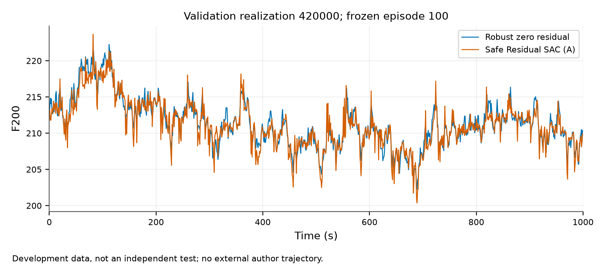
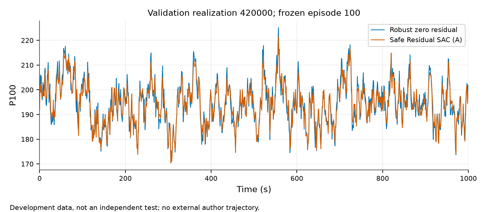
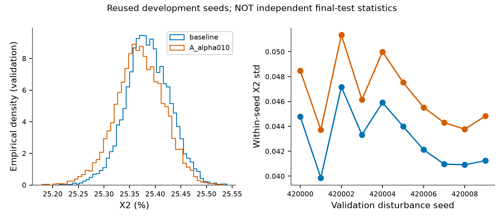
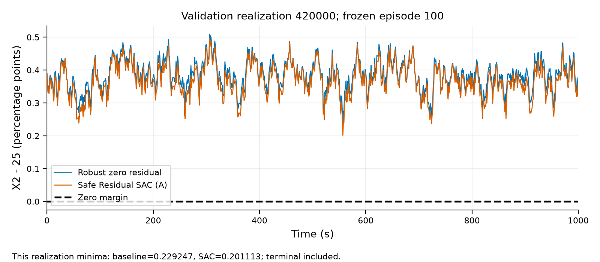
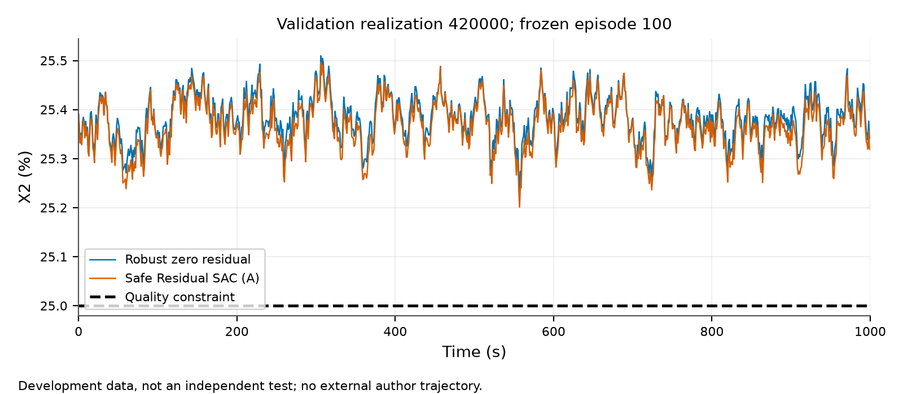
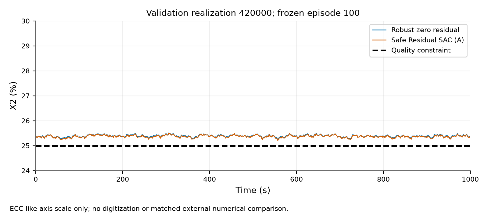
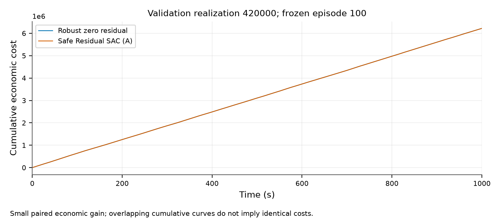
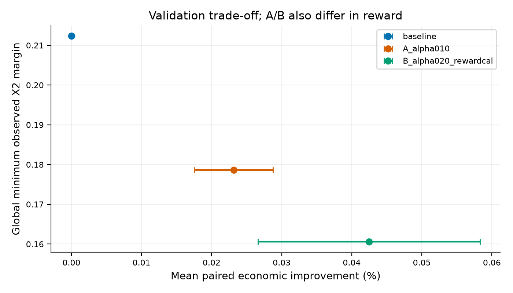
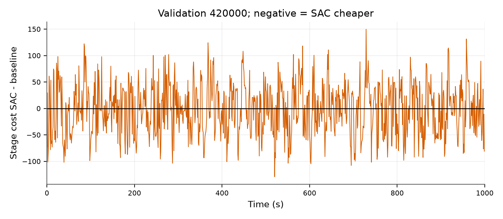

# Paper figures (validation/development only)

Representative trajectory seed=420000, fixed episode=100; not best-case selection.

## paper_F200_response.png

## paper_P100_response.png

## paper_X2_distribution.png

## paper_X2_safety_margin.png

## paper_X2_stochastic_response.png

## paper_X2_stochastic_response_ecc_axis.png

## paper_cumulative_economic_cost.png

## paper_economics_safety_tradeoff.png

## paper_instantaneous_economic_difference.png

The distribution is explicitly development visualization, not a held-out multi-seed test.
